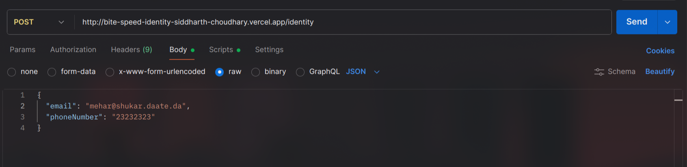

# 🔗 Identity Reconciliation Service

> A robust Next.js API service that intelligently links customer identities across multiple purchases by reconciling email addresses and phone numbers.
---

## 📋 Table of Contents

- [Problem Statement](#-problem-statement)
- [Live Demo](#-live-demo)
- [Features](#-features)
- [API Documentation](#-api-documentation)
- [How It Works](#-how-it-works)
- [Tech Stack](#-tech-stack)
- [Database Schema](#-database-schema)
- [Setup & Installation](#-setup--installation)
- [Testing](#-testing)
- [Deployment](#-deployment)
- [Author](#-author)

---

## 🎯 Problem Statement

FluxKart.com needs to identify and track customers who make purchases using different contact information (email/phone). This service consolidates customer identities by:

- Linking contacts that share email addresses or phone numbers
- Maintaining a primary-secondary relationship between linked contacts
- Providing a unified view of all customer contact information

**Real-world scenario:** A customer uses `email1@example.com` with `phone1` for their first order, then `email2@example.com` with the same `phone1` for a second order. This service links both identities to the same person.

---

## 🚀 Live Demo

**API Endpoint:** 
```
POST https://bite-speed-identity-siddharth-choudhary.vercel.app/identify
```

**Quick Test (cURL):**
```bash
curl -X POST https://bite-speed-identity-siddharth-choudhary.vercel.app/identify \
  -H "Content-Type: application/json" \
  -d '{"email":"test@example.com","phoneNumber":"1234567890"}'
```

---

## ✨ Features

- ✅ **Smart Contact Linking** - Automatically links contacts sharing email or phone
- ✅ **Primary Contact Management** - Oldest contact becomes primary, newer ones become secondary
- ✅ **Duplicate Prevention** - Doesn't create duplicate contacts for existing combinations
- ✅ **Multi-Primary Consolidation** - Merges separate identity chains when they're linked
- ✅ **Partial Matching** - Works with email-only, phone-only, or both
- ✅ **RESTful API** - Clean JSON request/response format
- ✅ **Error Handling** - Proper HTTP status codes and error messages

---

## 📚 API Documentation

### Endpoint

```
POST /identify
```

### Request Headers

```
Content-Type: application/json
```

### Request Body

```json
{
  "email": "string (optional)",
  "phoneNumber": "string (optional)"
}
```

> **Note:** At least one field (`email` or `phoneNumber`) must be provided.

### Response Format

**Success (200 OK):**
```json
{
  "contact": {
    "primaryContactId": 1,
    "emails": ["primary@example.com", "secondary@example.com"],
    "phoneNumbers": ["1234567890", "0987654321"],
    "secondaryContactIds": [2, 3]
  }
}
```

**Error (400 Bad Request):**
```json
{
  "error": "Email and phoneNumber not provided"
}
```

**Error (500 Internal Server Error):**
```json
{
  "error": "Database error"
}
```

### Example Usage

#### Postman



#### JavaScript (Fetch API)

```javascript
const response = await fetch('https://bite-speed-identity-siddharth-choudhary.vercel.app/identify', {
  method: 'POST',
  headers: { 'Content-Type': 'application/json' },
  body: JSON.stringify({
    email: 'customer@example.com',
    phoneNumber: '1234567890'
  })
});

const data = await response.json();
console.log(data.contact);
```

#### Python (Requests)

```python
import requests

response = requests.post(
    'https://bite-speed-identity-siddharth-choudhary.vercel.app/identify',
    json={
        'email': 'customer@example.com',
        'phoneNumber': '1234567890'
    }
)

print(response.json())
```

---

## 🔍 How It Works

### 1. **New Contact Creation**
When no existing contacts match the provided email or phone:
```
Request: { email: "new@example.com", phoneNumber: "123" }
→ Creates PRIMARY contact
→ Returns: { primaryContactId: 1, emails: ["new@example.com"], ... }
```

### 2. **Secondary Contact Creation**
When partial match found with new information:
```
Existing: { email: "old@example.com", phone: "123" }
Request:  { email: "new@example.com", phone: "123" }
→ Creates SECONDARY contact linked to existing primary
→ Returns both emails under same primary
```

### 3. **Primary Contact Consolidation**
When request links two separate primary contacts:
```
Existing Primary 1: { email: "alice@example.com", phone: "111" } [created 2023-01-01]
Existing Primary 2: { email: "bob@example.com", phone: "222" } [created 2023-01-15]
Request: { email: "alice@example.com", phone: "222" }
→ Primary 2 becomes SECONDARY of Primary 1 (older stays primary)
→ All contacts consolidated under Primary 1
```

### 4. **Duplicate Prevention**
When exact combination already exists:
```
Existing: { email: "same@example.com", phone: "123" }
Request:  { email: "same@example.com", phone: "123" }
→ No new contact created
→ Returns existing consolidated data
```

---

## 🛠 Tech Stack

| Component | Technology |
|-----------|-----------|
| **Framework** | Next.js 14 (App Router) |
| **Language** | TypeScript |
| **Database** | PostgreSQL |
| **BaaS** | Supabase |
| **Hosting** | Vercel |
| **API Style** | RESTful JSON |

---

## 🗄 Database Schema

```sql
CREATE TABLE Contact (
  id                SERIAL PRIMARY KEY,
  phoneNumber       VARCHAR(15),
  email             VARCHAR(255),
  linkedId          INTEGER REFERENCES Contact(id),
  linkPrecedence    VARCHAR(10) CHECK (linkPrecedence IN ('primary', 'secondary')),
  createdAt         TIMESTAMP DEFAULT NOW(),
  updatedAt         TIMESTAMP DEFAULT NOW(),
  deletedAt         TIMESTAMP
);

CREATE INDEX idx_email ON Contact(email) WHERE deletedAt IS NULL;
CREATE INDEX idx_phone ON Contact(phoneNumber) WHERE deletedAt IS NULL;
CREATE INDEX idx_linkedId ON Contact(linkedId) WHERE deletedAt IS NULL;
```

---

## 🚀 Setup & Installation

### Prerequisites
- Node.js 18+ 
- npm or yarn
- Supabase account

### 1. Clone the Repository
```bash
git clone https://github.com/IamSiddharthChoudhary/bitespeed-identity.git
cd bitespeed-identity
```

### 2. Install Dependencies
```bash
npm install
```

### 3. Environment Variables
Create a `.env.local` file:
```env
NEXT_PUBLIC_URL=your_supabase_url
NEXT_PUBLIC_KEY=your_supabase_anon_key
```

### 4. Run Development Server
```bash
npm run dev
```

The API will be available at `http://localhost:3000/identify`

---

## 🧪 Testing

### Manual Testing with cURL

**Test 1: Create New Contact**
```bash
curl -X POST http://localhost:3000/identify \
  -H "Content-Type: application/json" \
  -d '{"email":"test1@example.com","phoneNumber":"111"}'
```

**Test 2: Link with Existing**
```bash
curl -X POST http://localhost:3000/identify \
  -H "Content-Type: application/json" \
  -d '{"email":"test2@example.com","phoneNumber":"111"}'
```

**Test 3: Query Existing**
```bash
curl -X POST http://localhost:3000/identify \
  -H "Content-Type: application/json" \
  -d '{"phoneNumber":"111"}'
```

### Test Cases Coverage

✅ New contact creation  
✅ Secondary contact linking  
✅ Primary contact consolidation  
✅ Duplicate prevention  
✅ Email-only queries  
✅ Phone-only queries  
✅ Error handling (missing params)  

---

## 🌐 Deployment

This project is deployed on **Vercel** with automatic deployments from the `main` branch.

### Deploy Your Own

[](https://vercel.com/new/clone?repository-url=https://github.com/IamSiddharthChoudhary/bitespeed-identity)

**Steps:**
1. Fork this repository
2. Import to Vercel
3. Add environment variables (`NEXT_PUBLIC_URL`, `NEXT_PUBLIC_KEY`)
4. Deploy!

---

## 📁 Project Structure

```
.
├── app/
│   └── identify/
│       └── route.ts          # Main API endpoint logic
├── public/
│   └── image.png            # Postman screenshot
├── .env.local               # Environment variables (gitignored)
├── package.json
├── tsconfig.json
└── README.md
```

---

## 🤝 Contributing

Contributions are welcome! Please feel free to submit a Pull Request.

1. Fork the project
2. Create your feature branch (`git checkout -b feature/AmazingFeature`)
3. Commit your changes (`git commit -m 'Add some AmazingFeature'`)
4. Push to the branch (`git push origin feature/AmazingFeature`)
5. Open a Pull Request

---

## 📄 License

This project is created as part of the Bitespeed Backend Task.

---

## 👤 Author

**Siddharth Choudhary**

- GitHub: [@IamSiddharthChoudhary](https://github.com/IamSiddharthChoudhary)
- LinkedIn: [Add your LinkedIn]
- Email: [Add your email]

---

## 🙏 Acknowledgments

- Bitespeed for the interesting problem statement
- The Back to the Future references made this fun! 🚗⚡

---

<div align="center">

**⭐ Star this repo if you find it helpful!**

Made with ❤️ for the Bitespeed Backend Task

</div>